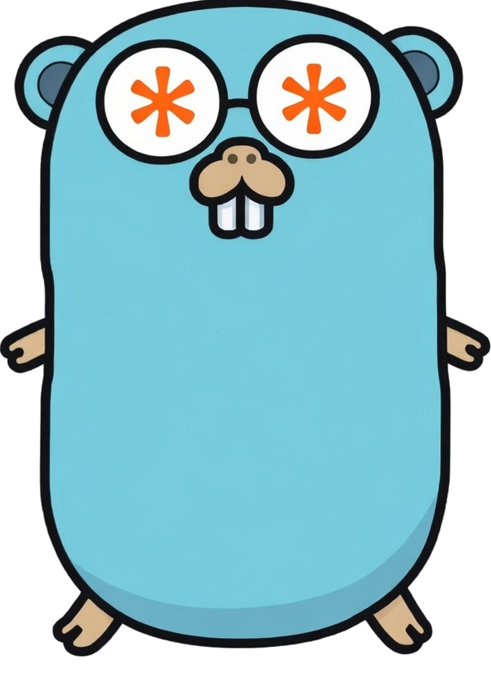

# Claude Agent SDK for Go

[](https://github.com/partio-io/claude-agent-sdk-go/actions/workflows/ci.yml)
[](https://goreportcard.com/report/github.com/partio-io/claude-agent-sdk-go)
[](https://pkg.go.dev/github.com/partio-io/claude-agent-sdk-go)
[](LICENSE)


<p align="center">
  
</p>

## Install
Build AI agents in Go. This SDK wraps the [Claude Code CLI](https://code.claude.com) as a subprocess — you send prompts, it streams back structured NDJSON. Multi-turn sessions, tool use, hooks, MCP servers, and subagents all work out of the box. Zero dependencies. Just `go get` and go.

```go
result, _ := claude.Prompt(ctx, "Refactor main.go to use dependency injection")
fmt.Println(*result.Result)
```

```bash
go get github.com/partio-io/claude-agent-sdk-go
```

Requires Go 1.26+ and the `claude` CLI installed.

## Usage

### One-shot prompt

```go
result, err := claude.Prompt(ctx, "What is 2+2?",
    claude.WithModel("claude-sonnet-4-6"),
)
if result.Subtype == claude.ResultSuccess {
    fmt.Println(*result.Result)
}
```

### Multi-turn session

```go
session := claude.NewSession(claude.WithModel("claude-sonnet-4-6"))
defer session.Close()

session.Send(ctx, "What is 5 + 3?")
for msg, err := range session.Stream(ctx) {
    if err != nil {
        log.Fatal(err)
    }
    switch m := msg.(type) {
    case *claude.AssistantMessage:
        for _, block := range m.Message.Content {
            if tb, ok := block.(*claude.TextBlock); ok {
                fmt.Println(tb.Text)
            }
        }
    case *claude.ResultMessage:
        fmt.Printf("Done in %d turns\n", m.NumTurns)
    }
}
```

### Resume session

```go
session := claude.ResumeSession(sessionID,
    claude.WithModel("claude-sonnet-4-6"),
)
defer session.Close()

session.Send(ctx, "What number did I ask you to remember?")
for msg, err := range session.Stream(ctx) { ... }
```

### Channel adapter

```go
ch := claude.ToChan(ctx, session.Stream(ctx))
for moe := range ch {
    if moe.Err != nil { ... }
    // handle moe.Message
}
```

### Hooks

```go
matcher := "Bash|Edit"
session := claude.NewSession(
    claude.WithHook(claude.HookPreToolUse, claude.HookMatcher{
        Matcher: &matcher,
        Handler: func(ctx context.Context, input claude.HookCallbackInput) (claude.HookOutput, error) {
            fmt.Printf("Tool: %s\n", input.ToolName)
            return claude.HookOutput{Decision: "allow"}, nil
        },
    }),
)
```

### MCP servers

```go
session := claude.NewSession(
    claude.WithMCPServer("postgres", &claude.MCPStdioServer{
        Command: "npx",
        Args:    []string{"@modelcontextprotocol/server-postgres", connString},
    }),
)
```

## Configuration

All options use the functional options pattern:

| Option | Description |
|--------|-------------|
| `WithModel(model)` | Claude model ID |
| `WithSystemPrompt(prompt)` | Replace system prompt |
| `WithCwd(dir)` | Working directory |
| `WithMaxTurns(n)` | Turn limit |
| `WithMaxBudgetUSD(budget)` | Spend limit |
| `WithAllowedTools(tools...)` | Auto-approve tools |
| `WithDisallowedTools(tools...)` | Remove tools |
| `WithPermissionMode(mode)` | Permission mode |
| `WithIncludePartialMessages(true)` | Token-level streaming |
| `WithMCPServer(name, config)` | MCP server |
| `WithHook(event, matcher)` | Lifecycle hook |
| `WithAgent(name, def)` | Subagent |
| `WithEnv(key, value)` | Subprocess env var |
| `WithVerbose(true)` | Debug output |

## Message Types

Messages use sealed interfaces with type switches:

```go
for msg, err := range session.Stream(ctx) {
    switch m := msg.(type) {
    case *claude.SystemMessage:     // session init
    case *claude.AssistantMessage:  // Claude's response
    case *claude.UserMessage:       // tool results
    case *claude.ResultMessage:     // final result
    case *claude.StreamEvent:       // partial streaming
    }
}
```

Content blocks within messages:

```go
for _, block := range assistantMsg.Message.Content {
    switch b := block.(type) {
    case *claude.TextBlock:       // text content
    case *claude.ThinkingBlock:   // extended thinking
    case *claude.ToolUseBlock:    // tool invocation
    case *claude.ToolResultBlock: // tool result
    }
}
```

## Architecture

```
Go SDK
  │ spawns: claude --print --input-format stream-json --output-format stream-json
  ├── stdin  → NDJSON (prompts, control responses)
  ├── stdout ← NDJSON (messages, control requests)
  └── stderr ← logs (optional callback)
```

The SDK never calls the Anthropic API directly — all communication goes through the Claude Code CLI subprocess.
